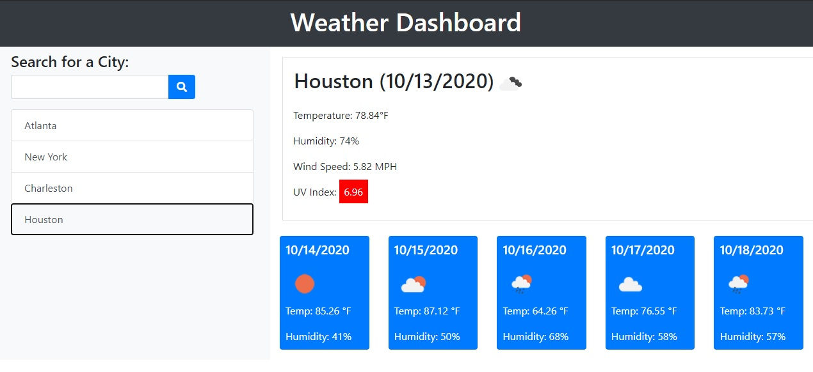

# Weather Dashboard

## Description

This application allows users to search for a city and obtain the current weather and 5-day forecast for that city. Cities searched are saved in a button list which can be used to obtain the weather information for the city again when clicked.

## Table of Contents

- [Description](#description)
- [User Story](#user-story)
- [Acceptance Criteria](#acceptance-criteria)
- [Installation](#installation)
- [Application Screenshot](#application-screenshot)
- [Installation](#installation)
- [Usage](#usage)
- [Development Challenges](#development-challenges)
- [Credits](#credits)

Use the [OpenWeather API](https://openweathermap.org/api) to retrieve weather data for cities. The documentation includes a section called "How to start" that will provide basic setup and usage instructions. Use `localStorage` to store any persistent data.

## User Story

```
AS A traveler
I WANT to see the weather outlook for multiple cities
SO THAT I can plan a trip accordingly
```

## Acceptance Criteria

```
GIVEN a weather dashboard with form inputs
WHEN I search for a city
THEN I am presented with current and future conditions for that city and that city is added to the search history
WHEN I view current weather conditions for that city
THEN I am presented with the city name, the date, an icon representation of weather conditions, the temperature, the humidity, the wind speed, and the UV index
WHEN I view the UV index
THEN I am presented with a color that indicates whether the conditions are favorable, moderate, or severe
WHEN I view future weather conditions for that city
THEN I am presented with a 5-day forecast that displays the date, an icon representation of weather conditions, the temperature, and the humidity
WHEN I click on a city in the search history
THEN I am again presented with current and future conditions for that city
WHEN I open the weather dashboard
THEN I am presented with the last searched city forecast

```

## Installation

In order to view this application, please visit the Weather Dashboard at https://ntch2000.github.io/weather-dashboard/.

To see the code base for this page, visit my github page https://github.com/ntch2000/weather-dashboard. The code can be viewed directly in the github repository or downloaded and viewed in Visual Studio Code.

## Application Screenshot


_Sample application screenshot showing the weather for Charleston._

## Usage

Users can easily enter any known city into the search bar on the dashboard and hit the search button with the magnifying glass icon. This will populate the weather dashboard with the current weather from the searched city as well as the 5-day forecast for that city.

Weather information included in the dashboard is as follows:

- Weather Icon - Represents the current weather in the city
- Temperature
- Humidity
- Wind Speed
- UV Index

The 5-day forecast information includes:

- Weather Icon - Represents the weather for the specified date
- Temperature for the specified date
- Humidity for the specified date

The city that was searched will also populate a search history below the search box as a button. As more cities are searched, the history will fill. Users are then able to click on any of the city buttons previously searched in order to repopulate that city's weather information. This search history will persist even if the page is reloaded and will display the weather from the last city that was searched on page refresh.

## Development Challenges

The most challenging aspect of this project was handling AJAX API call errors. The application is able to throw an error and a bootstrap modal appears on the screen indicating the user needs to enter a valid city.

An error is still thrown in the console due to the API url not being valid. The only way to prevent this from happening would be to hard code a list of cities to compare the input to and see if there is a match before performing the AJAX API call.

## Credits

- In order to obtain the weather data for the cities, the [OpenWeather API](https://openweathermap.org/api) was used.
- [Bootstrap 4](https://getbootstrap.com/) was used to style the pages.
- The [jQuery CDN](https://code.jquery.com/) was used in order to use the jQuery library in this project.
- [Font Awesome](https://fontawesome.com/) was used to get the search icon on the search button.

---

© 2020 Neil Gandhi
